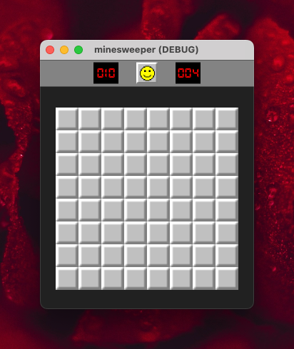
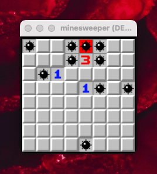
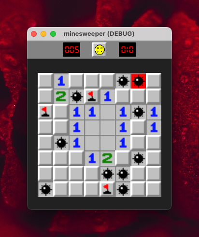
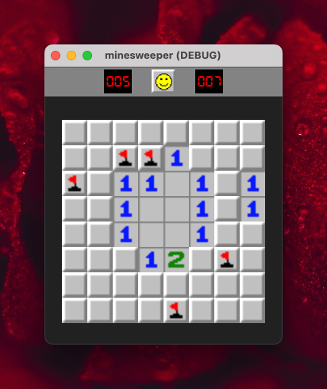

# Minesweeper

Minesweeper is a classic puzzle game where the objective is to clear a rectangular board containing hidden "mines" without detonating any of them. The game provides clues about the number of neighboring mines in each field to assist the player.

# Project Goal

- [x] Get to know about Godot4 and GDScript !
- [x] Develop my first game with the Godot Engine!

## Screenshots

<table>
  <tr>
	<td style="text-align: center;">
	   
	</td>
	<td style="text-align: center;">
	   
	</td>
  </tr>
  <tr>
	<td style="text-align: center;">
		 
	</td>
	<td style="text-align: center;">
		 
	</td>
  </tr>
</table>

## Development Tools and Technologies

- **Engine:** Godot 4
- **Language:** GDScript
