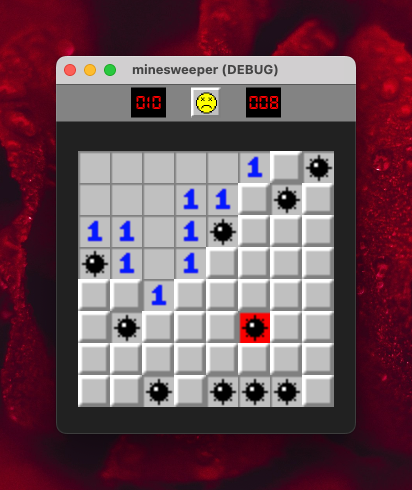

# Minesweeper

Minesweeper is a classic puzzle game where the objective is to clear a rectangular board containing hidden "mines" without detonating any of them. The game provides clues about the number of neighboring mines in each field to assist the player.

## Current Progress

The game is currently under development using Godot 4. Below is an image showcasing the current progress of the game:

<table>
  <tr>
    <td style="text-align: center;">
       
      Strategic Play
    </td>
    <td style="text-align: center;">
       
      Game Over! Bomb Exploded
    </td>
  </tr>
</table>

## Development Tools and Technologies

- **Engine:** Godot 4
- **Language:** GDScript
